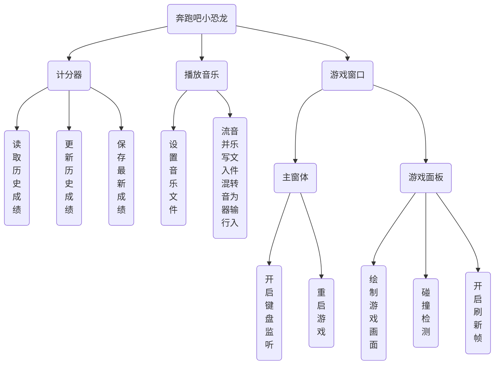
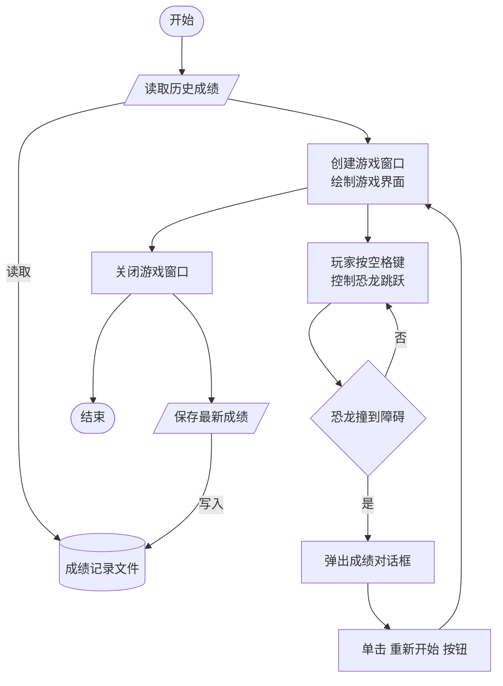

# Dinosaur
A clone of the classic chrome dinosaur game using Java

#### 游戏概述：

奔跑吧小恐龙是一款简单的跑酷游戏。玩家控制小恐龙向前狂奔，躲避沿途出现的石头和仙人掌，跑得越远，得分越高，游戏还添加了背景音乐、跳跃音效和碰撞音效。

- 使用线程实现动画效果
- 使用AWT绘制游戏画面
- 使用Rectangle类实现碰撞检测
- 使用javax.sound包实现播放声音

#### 系统结构设计

##### 系统功能结构

##### 系统业务流程

#### 项目目录结构预览

- Dinosaur ··························································   项目名

  - data ···························································   成绩记录文件夹

  - image  ·······················································   图片素材文件夹

  - music  ·······················································   音乐文件夹

  - src ·····························································   源代码文件夹

    - com.mr

      -  main ············································  入口包
        - Start.java ······························  启动类
      - modle ··········································  模型包
        - Dinosaur.java ······················   恐龙类
        - Obstacle.java ·······················  障碍类
      - service ·········································· 服务包
        - FreshThread.java ················· 刷新帧线程
        - MusicPlayer.java ·················· 音乐播放器类
        - ScoreRecorder.java ············· 分数记录器类
        - Sound.java ···························· 音效类
      - view ·············································· 视图包
        - BackgroundImage.java ······· 滚动背景
        - GamePanel.java ··················· 游戏面板
        - MainFrame.java ··················· 主窗体
        - ScoreDialog.java ·················· 成绩对话框

      

 

